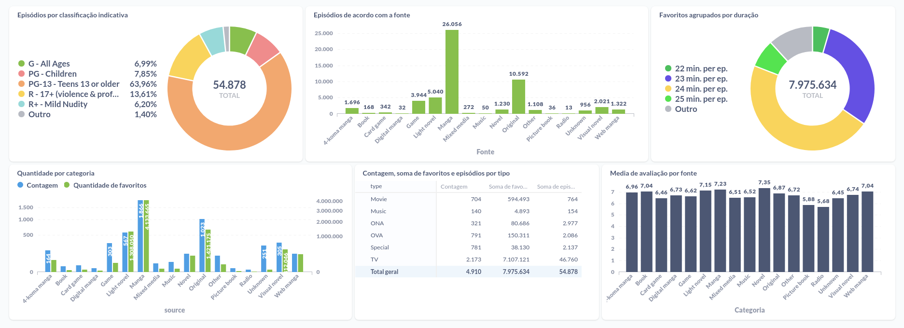

# Visualização de dados MyAnimeList 


## Organização dos dados
Os dados são salvos em formato json que é o formato que é mandado para o **mongodb**. Veja os exemplos dos dados na pasta `docs`
Todos os dados que estão sendo pegos pelo bot vem do [MyAnimeList](https://myanimelist.net/).

## Como rodar
- Primeiro instale as dependências:
    ```shell
    pip3 install -r requirements.txt
    ```
- Baixe um [**chromedriver**](https://chromedriver.chromium.org/downloads) compatível com a versão do seu navegador Chrome.

- Configure o `.env` com o caminho completo do chromedriver e informações dos bancos de dados Mongo e Postgres.

- Rode o crawler com o usuário desejado
    ```shell
    python3 ./src/crawler.py -n MarcosInja 
    ```
- Rode o Higienizador de dados para salva-los no Postgres
    ```
    python3 ./src/saned_data.py
    ```

